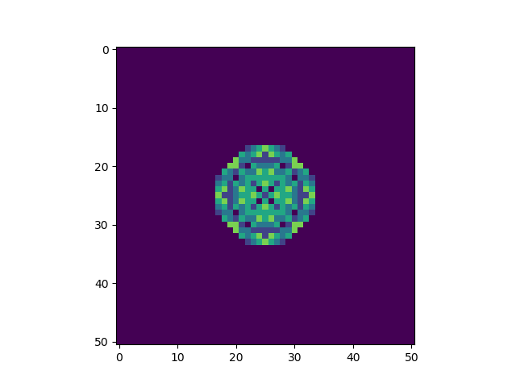

  

<h3 align="center">Cellular Automata simulating sand disposal on rotating disk</h3>
---

 
    Project created as part of Engineering Thesis. 
      
    It is a cellular automaton simulating sand relocation on a rotating disk.
      

## Table of Contents

- [Built Using](#built_using)
- [Authors](#authors)

## Built Using 

- [Python](https://www.python.org) - Language
- [Numpy](https://numpy.org) - Data structure
- [Matplotlib](https://matplotlib.org/index.html) - Plotting

## Authors 

- [@JPersjanow](https://github.com/JPersjanow) - Creator
